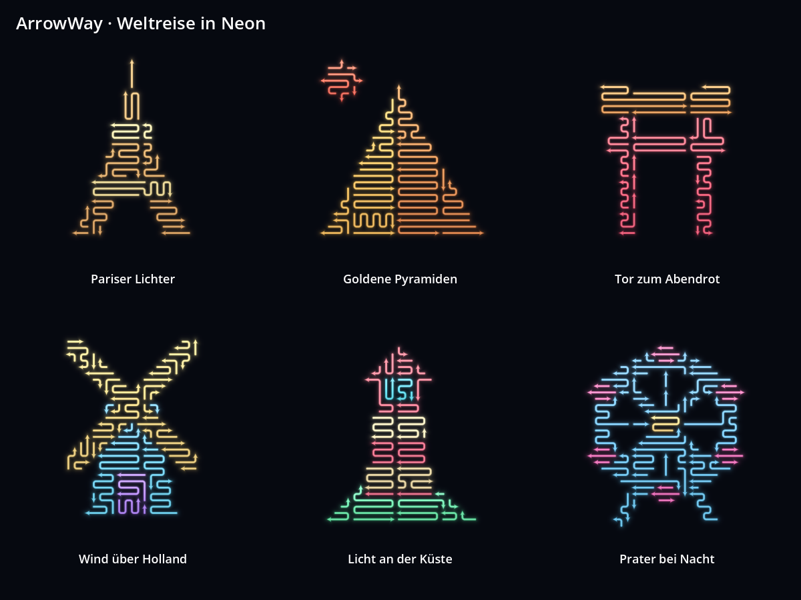
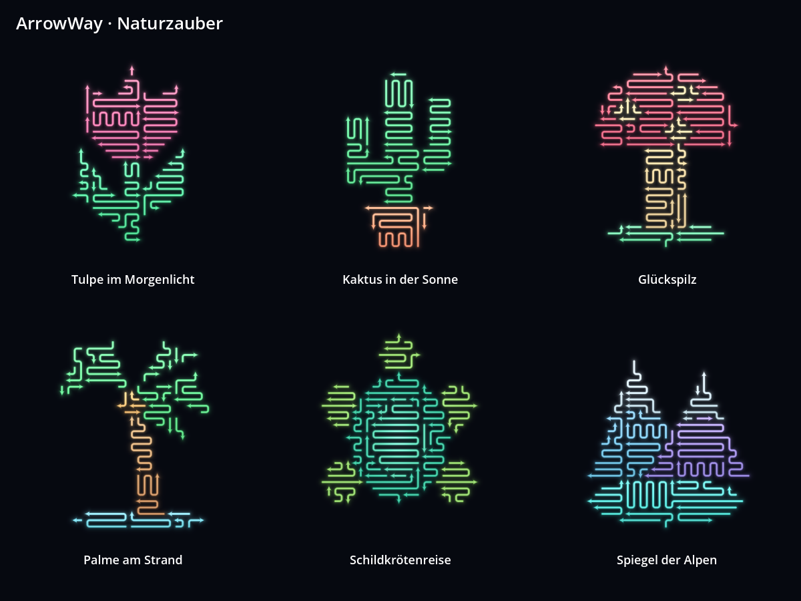
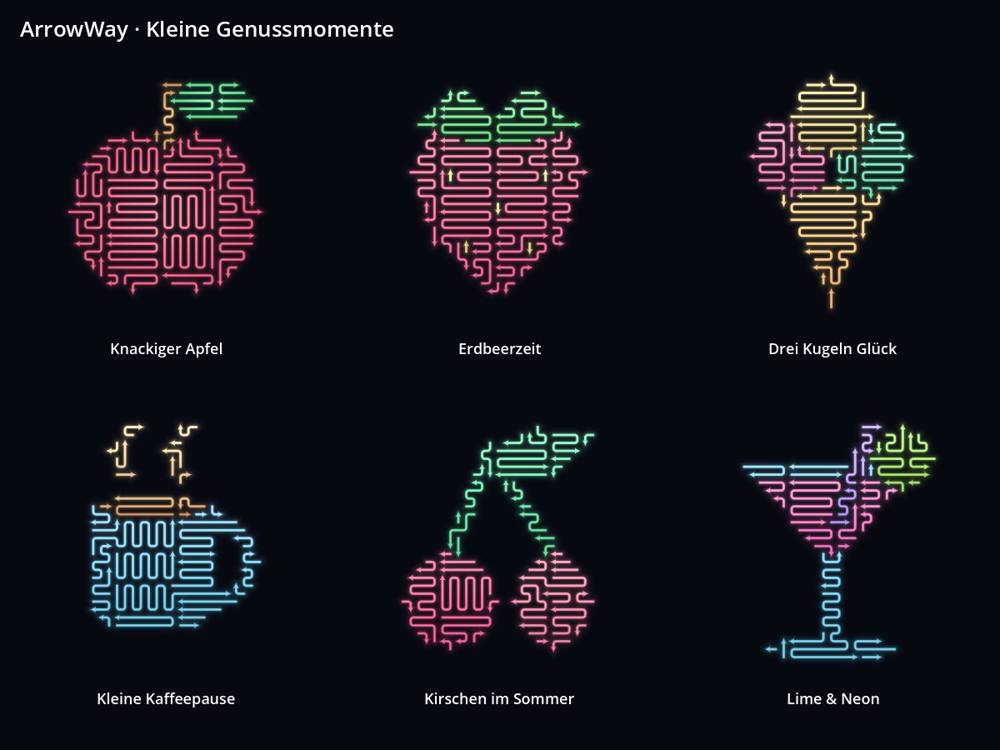
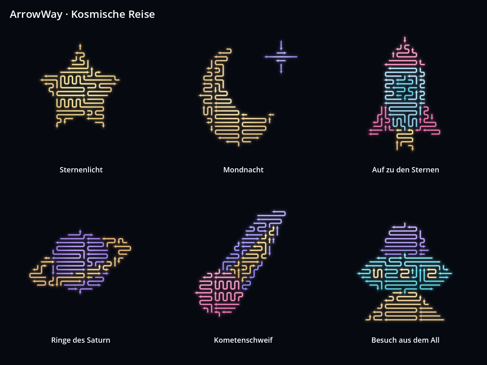
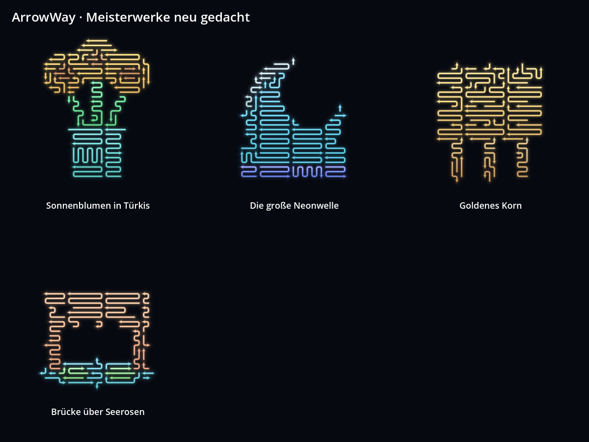

# ArrowWay · Motivsammlungen

Ab Version 0.11.0 gibt es neben den neun Einstiegspuzzles **28 weitere spielbare Motive in fünf Sammlungen**. Im Spiel **Alle Levels** öffnen und oben eine Sammlung wählen. Die neuen Sammlungen sind sofort zugänglich. Geschaffte Motive werden gespeichert; **Nächstes Puzzle** bleibt in der Sammlung und kehrt nach ihrem letzten Motiv zur Übersicht zurück.

| Sammlung | Motive |
|---|---|
| Weltreise in Neon · 6 | Pariser Lichter, Goldene Pyramiden, Tor zum Abendrot, Wind über Holland, Licht an der Küste, Prater bei Nacht |
| Naturzauber · 6 | Tulpe im Morgenlicht, Kaktus in der Sonne, Glückspilz, Palme am Strand, Schildkrötenreise, Spiegel der Alpen |
| Kleine Genussmomente · 6 | Knackiger Apfel, Erdbeerzeit, Drei Kugeln Glück, Kleine Kaffeepause, Kirschen im Sommer, Lime & Neon |
| Kosmische Reise · 6 | Sternenlicht, Mondnacht, Auf zu den Sternen, Ringe des Saturn, Kometenschweif, Besuch aus dem All |
| Meisterwerke neu gedacht · 4 | Sonnenblumen in Türkis, Die große Neonwelle, Goldenes Korn, Brücke über Seerosen |

Die Kunstsammlung interpretiert Motive wie Sonnenblumen, Korn, Wellen und Seerosen als vereinfachte Pfeilbilder. Alle Motive haben breite Farbflächen, gerundete Neonpfeile und automatisch abgestimmte Farbverläufe. Jeder belegte Rasterpunkt gehört genau einem Pfeil. Sämtliche Puzzles sind vollständig lösbar und wurden zusätzlich über die tatsächliche Spiellogik durchgespielt. Das Spielgefühl und die Schwierigkeit brauchen weiterhin menschliche Spieltests.











## Bibliothek für viele Motive

`collections/catalog.json` enthält Titel, Dateipfade, Sammlungszuordnung und Bewertungswerte. Die Pfeilgeometrie liegt getrennt in `collections/levels/`. Beim Katalogaufbau wird die Geometrie dieser gelieferten Motive nicht geladen oder erneut gelöst. Die Übersicht erzeugt höchstens zwölf Vorschauen pro Seite; Filter und Seitenwechsel erlauben das Durchblättern größerer Bibliotheken.

Ein automatisierter Test prüft die echte Übersicht mit einem Index aus 1.000 Einträgen, einschließlich der letzten Seite. Dafür wird dieselbe Geometrie wiederverwendet: Der Test prüft Seitenlogik und Anzahl der Vorschauen, keinen Benchmark mit 1.000 unterschiedlichen Dateien. Eine veröffentlichte Bibliothek dieser Größe braucht später zusätzlich Suche, Tags, Favoriten und bei großen Downloads einzelne Sammlungspakete.

Die neun Einstiegspuzzles behalten ihre Freischaltungen. Fortschritte zusätzlicher Motive werden über ihre Dateipfade gespeichert, damit eingefügte Motive bestehende Abschlüsse nicht verschieben. Eigene Exporte im Ordner `levels/` erscheinen als **Eigene Motive**. Solche extern bearbeitbaren Exporte werden weiterhin streng beim Einlesen geprüft.

## Motive weiterbearbeiten

In der Motivwerkstatt **Öffnen → Bild, Motiv oder Level-Datei** wählen und ein JSON aus `collections/levels/` öffnen. Flächen, Pfeile und Farben lassen sich wie bei eigenen Motiven bearbeiten. Für eine persönliche Variante unter einem eigenen Namen in `levels/` exportieren.

`collections/source_masks.json` speichert die Ausgangsflächen. `tools/generate_collections.gd` erzeugt daraus die gelieferten Level und den Katalog mit festen Seeds. Unfüllbare einzelne Randspitzen werden vor der Füllung mit benachbarten Farbflächen vereinigt oder am äußeren Umriss geglättet; innere Löcher werden nicht erzeugt. Die endgültige Maske muss lückenlos und lösbar gefüllt sein.

```powershell
godot --headless --path . --script res://tools/generate_collections.gd -- --test
godot --path . --script res://tools/preview_collections.gd -- --test
godot --headless --path . --script res://tests/test_collections.gd -- --test
```

Der Generator überschreibt die gelieferten Sammlungsdateien. Bearbeitete Varianten vorher unter eigenem Namen sichern. Die Vorschauen werden mit dem tatsächlichen Neonrenderer erzeugt und benötigen einen Grafikrenderer.

## Vorgemerkte spätere Themen

Weihnachten, Winter, Halloween, Schwimmbad und Sommer, Fußball mit Turnierthemen, Sport und Boxen, Fahrzeuge sowie Landschaften und Berge. Diese Themen sind noch keine fertigen Sammlungen. Gute Startmotive wären Weihnachtskugel, Schneemann, Kürbis, Schwimmring, Fußballschuh, Boxhandschuhe, Cabrio, Heißluftballon und Bergsee. Breite Silhouetten und wenige gut unterscheidbare Farbflächen haben Vorrang vor kleinen Details.
