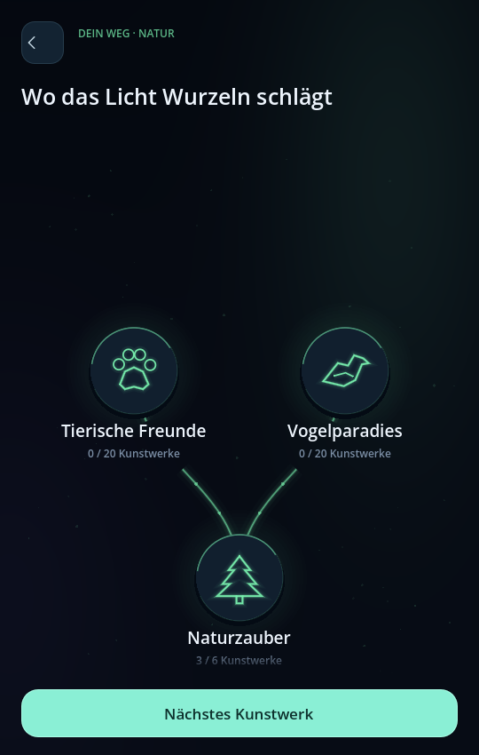
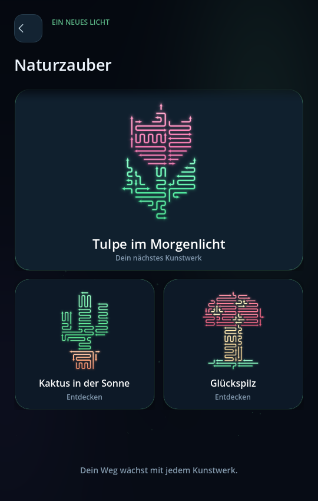

# Deine Reise · erster spielbarer Menüumbau

Die Reise verbindet sieben Themenwelten über einen geschwungenen Lichtpfad: Das erste Licht, Natur, Feste & Jahreszeiten, Technik & Weltall, Unterwegs, Genuss & Gemütlichkeit sowie Kunst & Freizeit. Die dunkle, ruhige Umgebung lässt die farbigen Stationen und Kunstwerke wirken.

Zukünftige Welten bleiben blass sichtbar. Ihre Sammlungen und Motive sind verborgen. Erreichte Welten entfalten eigene Abzweigungen; neue Wege und Stationen erscheinen weich und rücken ins Blickfeld. Die Karte lässt sich per Finger ziehen und gleitet nach dem Loslassen sanft aus. Ein Wischen über eine Station öffnet diese nicht versehentlich.

Die Sammlung zeigt das nächste Kunstwerk groß, daneben weitere verfügbare Motive. Die Vorschauen verwenden die tatsächlichen Pfeile, Farben und Verläufe. Ein laufendes Puzzle lässt sich ohne Neustart wieder aufnehmen.

## Freischaltungen

- Drei verschiedene Einstiegsmotive öffnen die erste Themenwelt.
- Drei geschaffte Motive in einer Themenwelt öffnen die ersten zusätzlichen Sammlungen.
- Fünf öffnen die übrigen Sammlungen und die nächste Themenwelt.
- Jede erreichte Sammlung startet mit drei Motiven; jede erstmalige Lösung öffnet ein weiteres.
- Geschaffte Motive bleiben spielbar. Eigene Exporte sind sofort zugänglich.

Diese Schwellen sind ein erster Rhythmus zum Ausprobieren und können später angepasst werden. Alle 500 Katalogmotive bleiben erreichbar und mit der separaten Motivwerkstatt bearbeitbar. Bestehende Lösungen und zuvor begonnene Katalogmotive werden übernommen.

## Entwicklungsstand

Der Umbau liegt auf `feature/neon-progression-map`. Die vorherige Version bleibt auf `main` erhalten. Prüfung: echte Touchereignisse im Desktop-Spiel, Hochformat, Fortsetzung laufender Puzzles, Migration älterer Spielstände und vollständige Erreichbarkeit des Katalogs. Das Touchgefühl auf einem echten Smartphone muss anschließend noch geprüft werden.
