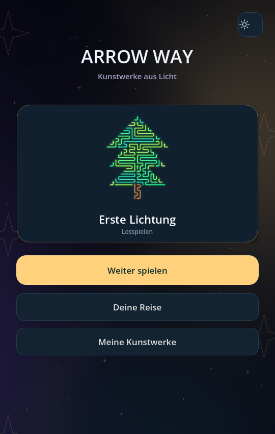
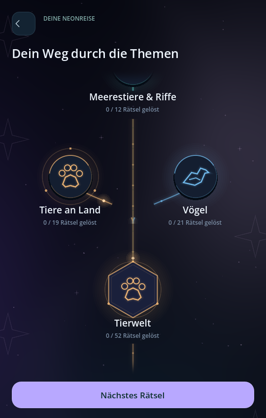
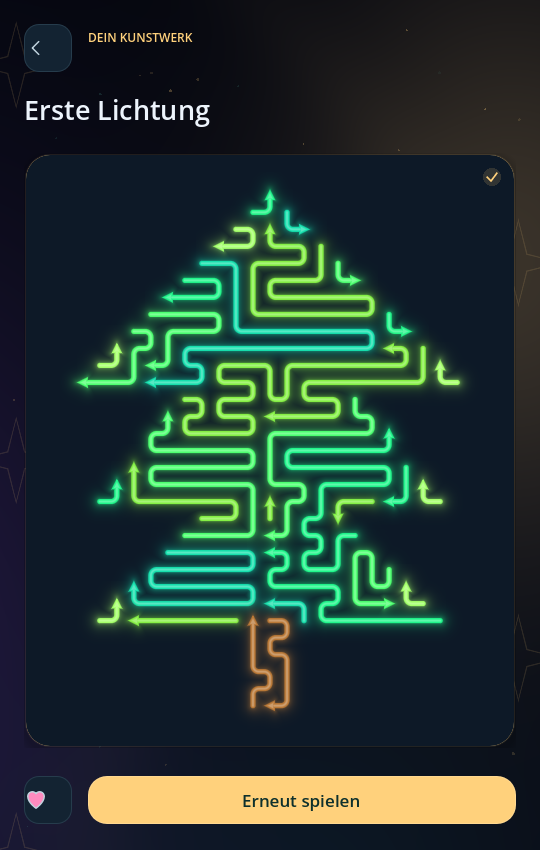

# Deine Reise · erster spielbarer Menüumbau

Die Reise verbindet vierzehn Themenwelten über einen geschwungenen Lichtpfad: Das erste Licht, Tierwelt, Pflanzen & Garten, Landschaften & Naturkräfte, Feste & Jahreszeiten, Zuhause & Alltag, Essen & Genuss, Handwerk & Arbeitswelten, Technik & Wissenschaft, Weltraum & Zukunft, Unterwegs & Bauwerke, Kunst & Literatur, Musik, Spiel & Sport sowie Fantasie & Märchen. Die dunkle, ruhige Umgebung lässt die farbigen Stationen und Kunstwerke wirken.

Zukünftige Welten bleiben blass sichtbar. Ihre Sammlungen und Motive sind verborgen. Erreichte Welten entfalten eigene Abzweigungen; neue Wege und Stationen erscheinen weich und rücken ins Blickfeld. Die Karte lässt sich per Finger ziehen und gleitet nach dem Loslassen sanft aus. Ein Wischen über eine Station öffnet diese nicht versehentlich.

Überkategorien und Unterkategorien stehen auf derselben zusammenhängenden Mindmap. Themen öffnen keine zusätzliche Kartenansicht. Nur Unterkategorien öffnen direkt ihre Rätselbilder.

Die Sammlung zeigt sämtliche gelösten und ungelösten Motive gemeinsam in fester Reihenfolge; es gibt keinen zusätzlichen Aufklappbereich für gelöste Bilder. Die Vorschauen verwenden die tatsächlichen Pfeile, Farben und Verläufe. Ein laufendes Puzzle lässt sich ohne Neustart wieder aufnehmen.

## Freischaltungen

- Jede erreichte Themenwelt zeigt ihre Unterkategorien auf derselben Karte.
- Sämtliche Rätsel einer erreichten Unterkategorie sind in ihrer Übersicht verfügbar.
- Ein Häkchen an einer Unterkategorie bedeutet: alle ihre Rätsel gelöst.
- Ein Häkchen an einer Themenwelt bedeutet: alle Rätsel sämtlicher Unterkategorien gelöst.
- Erst dann wird die nächste Themenwelt verfügbar. Für die Tierwelt sind alle neun Einstiegsmotive erforderlich.
- Geschaffte Motive bleiben spielbar. Interne Editorentwürfe sind im Spiel verborgen; ausdrücklich veröffentlichte Zusatzmotive werden einer normalen Unterkategorie zugeordnet.

Alle 500 Katalogmotive bleiben erreichbar und mit der separaten Motivwerkstatt bearbeitbar. Bestehende einzelne Lösungen und zuvor begonnene Motive werden erhalten. Beim Umbau von Version 0.18 bleiben bereits erreichte Sammlungen auch an ihren neuen Stellen zugänglich. Dadurch kann eine ältere Reise einzelne offene Zweige in sonst noch unvollständigen Welten haben. Verborgene Geschwisterzweige bleiben gesperrt; ein Häkchen gibt es weiterhin ausschließlich für alle Lösungen. Neue Spielstände folgen der vollständigen Abschlussregel. Die [vollständige Struktur](planning/KATALOGSTRUKTUR_AKTUELL.md) enthält auch die vorbereiteten, noch leeren Kategorien.

## Kunstwerkealbum und Menü

Im Hauptmenü stehen Weiter spielen, Deine Reise und Meine Kunstwerke sowie ein kleines Einstellungssymbol. Das Album zeigt nur gelöste veröffentlichte Motive. Ein Motiv öffnet die große Bildansicht mit Herz und Erneut spielen. Lieblingsbilder sind ein Filter innerhalb des Albums, kein zweiter Zugang zu verborgenen Rätseln.

Themenwelten sind sechseckig, Unterkategorien rund. Jeder Zweig hat eine passende Neonfarbe. Wanderndes Licht zeigt den nächsten offenen Weg; eine vollständig gelöste Sammlung leuchtet auf und eine fertige Themenwelt öffnet den nächsten Weg mit einer Kamerafahrt. Häkchen und Freischaltung bleiben an sämtliche gelösten Rätsel gebunden.

## Entwicklungsstand

Der Umbau liegt auf `feature/neon-progression-map`. Die vorherige Version bleibt auf `main` erhalten. Prüfung: echte Touchereignisse im Desktop-Spiel, Hochformat, Fortsetzung laufender Puzzles, Migration älterer Spielstände und vollständige Erreichbarkeit des Katalogs. Das Touchgefühl auf einem echten Smartphone muss anschließend noch geprüft werden.
