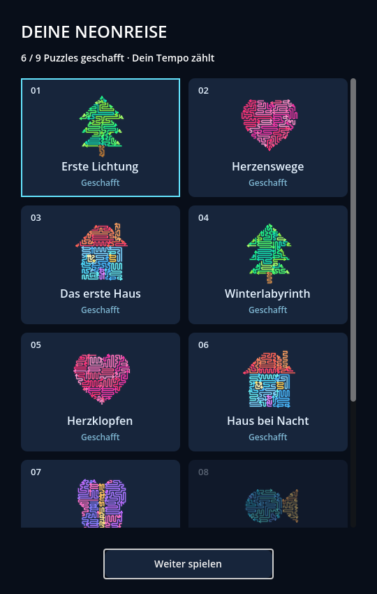
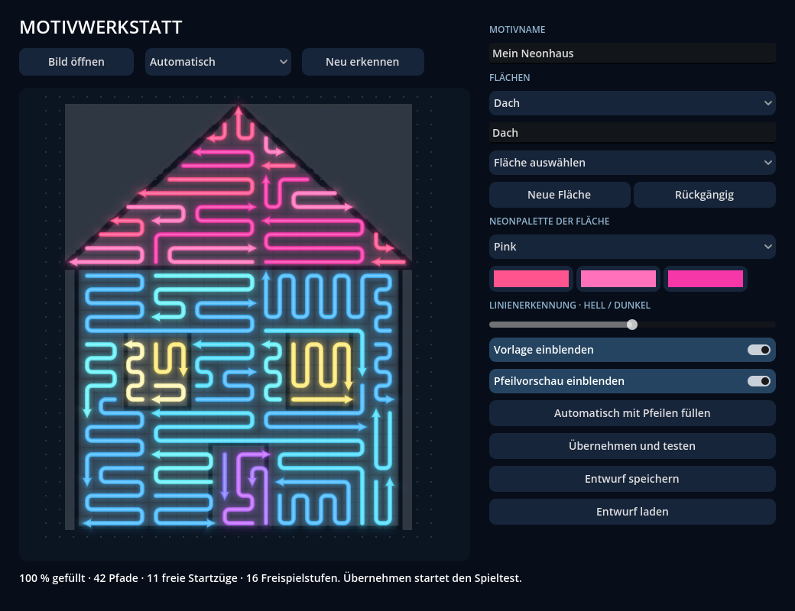
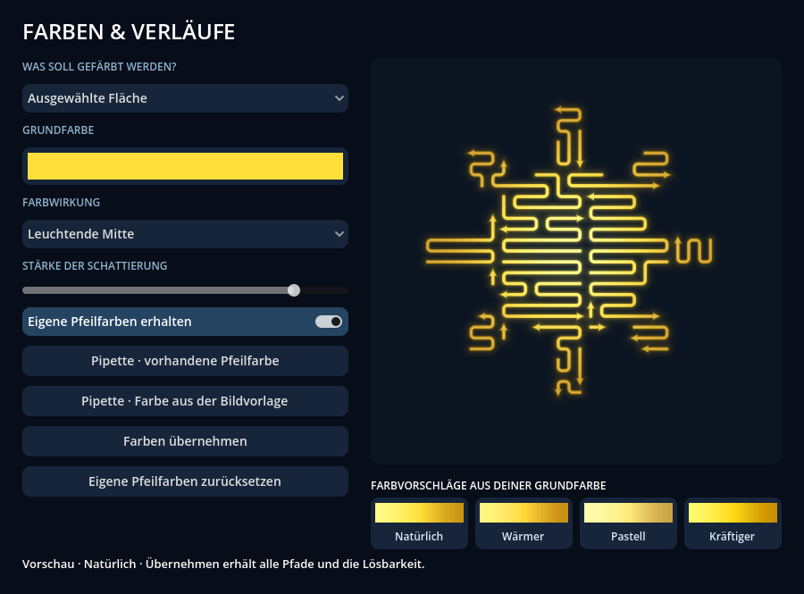

# ArrowWay

Ein spielbares Godot-Puzzle mit leuchtenden, gerundeten Pfeilpfaden. Die Motive sind auf einem gleichmäßigen Raster vollständig gefüllt: freie Pfade entkommen entlang ihrer Linie, blockierte Pfade bleiben liegen. Das Level-Werkzeug startet separat vom Spiel.


## Start

Godot **4.x Standard** verwenden; geprüft mit **4.7.2**, GDScript und Compatibility-Renderer. `project.godot` importieren und **F5** drücken. Die ausführliche deutsche Anleitung steht in [START.md](START.md).

## Aktueller Stand · 0.20.1-dev

- **Erweiterter Katalog**: 823 Motive (814 Katalogbilder und neun Einstiegsrätsel) in 17 spielbaren Themenwelten und 88 Sammlungen. 314 neue Bilder ergänzen unter anderem Medizin, Wissenschaft, Geschichte, Zuhause, Insekten, Reptilien und alte Technik. Alle 123 fachlichen Unterkategorien enthalten Motive. Jedes neue Bild hat einen Abschlusstext; neun neue Fakten sind mit Quellen belegt. Alle Bilder bleiben in der Motivwerkstatt bearbeitbar. [Neue Motive und Sammlungen](planning/MOTIVAUSBAU_AKTUELL.md).

- **Motivfarben überarbeitet**: Alle 314 neuen Motive haben jetzt benannte, separat editierbare Farbflächen mit Materialfarben und sanften Verläufen. Pfeilwege, Reihenfolge, Lösungen und Umrisse bleiben gleich. Laufende Spielstände der vorherigen einfarbigen Version werden nur bei identischer Pfeilgeometrie übernommen.

- **Bildquellen**: 295 neue Silhouetten verwenden lizenzierte Vorlagen, 19 sind eigene Entwürfe. Unter Einstellungen → Bildquellen & Lizenzen stehen Urheber, Lizenz und Originalquelle jedes neuen Motivs. Details in [ART_CREDITS.txt](collections/ART_CREDITS.txt).

- **Werbegrundlage mit Offline-Testmodus**: Fünf erste Rätsel werbefrei, danach mindestens vier neue Abschlüsse und sechs aktive Spielminuten zwischen Anzeigen. Nur normale Rätselwechsel kommen infrage; Abschlussfeiern und neue Welten sind geschützt. In den Entwicklungseinstellungen lassen sich Testanzeigen und ein simulierter Werbefrei-Status einschalten. Keine echten Anzeigen oder Käufe. Regeln und späterer Anschluss stehen in [MONETIZATION.md](MONETIZATION.md).

Der Lichtschein im Spielfeld ist etwas kräftiger und breiter abgestimmt; die dunkle Mitte bleibt erhalten.
Einzelne schwache, unbewegte Sternpunkte ergänzen die Atmosphäre und bleiben am Rand sichtbarer als in der Mitte.

- **Ruhige Atmosphäre im Spielfeld**: Ein statischer Lichtschein an den äußeren Rändern übernimmt die beiden stärksten Grundfarben des vollständigen Motivs. Die Mitte bleibt dunkel; keine bewegten Partikel oder Konturen lenken vom Antippen ab. Die Palette bleibt während des Spielens konstant. Nach dem letzten Pfeil verstärkt sich der Schein kurz im Takt des Kunstwerks und klingt wieder ab. Zoom und Verschieben bewegen ausschließlich das Motiv.

- **Lichtwelt für Startseite und Reise**: Farbiger Lichtnebel, ruhige Sternpunkte und feine Konturen am Rand. Die Atmosphäre wechselt entlang des Pfads mit der Themenwelt; Hintergrundkonturen bewegen sich beim Scrollen langsamer als die Stationen. Nach dem ersten Abschluss zeigt die Startseite das zuletzt gelöste veröffentlichte Kunstwerk mit sanftem Leuchten und direktem Zugang zum Album. Der Spielstart bleibt separat erreichbar. Hintergrundelemente fangen keine Eingaben ab und verraten keine gesperrten Unterkategorien.

Der Menüumbau liegt auf `feature/neon-progression-map`; `main` bleibt bei der vorherigen Version.

- **Deine Reise**: ein nach oben führender Neonpfad mit vierzehn großen Themenstationen. Überkategorien und ihre Unterkategorien liegen durch sichtbare Pfade verbunden auf derselben Karte. Erst Unterkategorien öffnen ihre vollständige Rätselübersicht. Häkchen und die nächste Themenwelt gibt es erst nach sämtlichen zugehörigen Lösungen. Zukünftige Themen bleiben dezent sichtbar, ihre Inhalte verborgen. Wischen, sanftes Ausgleiten und gespeicherte Kartenpositionen erleichtern die Navigation. [Ansichten und Freischaltungen](JOURNEY.md).

- **Begonnene Rätsel fortsetzen**: Jeder angefangene Spielstand bleibt separat erhalten – einschließlich entkommener Pfeile, laufender Animationen, Zoom und Bildposition. Speichern läuft im Hintergrund; beim Verlassen oder Wechsel in den Hintergrund wird der letzte Stand gesichert. Eine vorherige Sicherung dient bei beschädigter Datei als Rückfall. Veränderte Motive übernehmen keine unpassenden alten Pfeilstände. Ein bestätigter Neustart beginnt bewusst von vorn.

- **Entdeckungen nach dem Abschluss**: Nach der Lichtwelle erscheint eine lesbare Textkarte mit Fakten, Kunstgeschichten oder eigenen Gedanken. Alle 823 Spielmotive haben eigene Texte (59 Fakten/Kunstgeschichten mit Quelle und 764 eigene Gedanken). Fakten enthalten eine Quellenaktion. Die Karte verdeckt weder Kunstwerk noch Weiter-Button und verschwindet beim Neustart.

- **Kompakter Bildtitel**: ursprüngliche Darstellung mit 16-Punkt-Schrift zwischen den Symbolen, unterhalb des Kameraausschnitts. Kameraausschnitt und sichere Displayränder werden aus physischen Bildschirmkoordinaten in die Spielansicht umgerechnet.

- **Android im festen Hochformat**: Start und Spielansicht bleiben im Hochformat, auch bei gedrehtem Gerät.

- **Zoom und Verschieben**: Zwei Finger vergrößern das Motiv bis zum Vierfachen und verschieben es gleichzeitig. Im vergrößerten Bild verschiebt auch ein Finger. Gesten lösen keine Pfeile aus; ein Tipp wird erst beim Loslassen ausgeführt. Zurückzoomen zentriert die Gesamtansicht. Am PC: Mausrad und Ziehen. Neustart und Abschluss zeigen das ganze Kunstwerk.

- **Große Spielansicht für Hochformat und Touch**: Das Motiv nutzt den verfügbaren Platz ohne Dropdownliste, Sound-Schalter oder laufende Erklärungstexte. Oben bleiben drei Symbole mit 48 × 48 großen Trefferflächen; der nächste Schritt erscheint erst nach dem Abschluss. Die Motive skalieren ohne Verzerrung mit dem Bildschirm. Versetzte Tipps wählen den nächstgelegenen vorhandenen Pfeil mit erweitertem Abstand. Hauptmenü, Reise, Kunstwerkealbum und Soundeinstellungen sind getrennte Ansichten; Neustart nach begonnenem Spiel erfordert eine Bestätigung.

- **Neonkunstwerk zum Abschluss**: Nach dem letzten entkommenen Pfeil bringt eine weiche Lichtwelle die ursprünglichen Pfeilbahnen samt individuellen Farben und Verläufen zurück. Ein kurzer Leuchtimpuls geht in ein helles Standbild über; nach 1,95 Sekunden ist das nächste Puzzle verfügbar. Neustart und Levelwechsel setzen die Darstellung zurück.

- **Meine Kunstwerke** enthält ausschließlich gelöste, veröffentlichte Motive. Große Bildansicht, gespeicherte Herzen und Lieblingsbilder; sechs Vorschauen pro Albumseite. Kein Suchzugang zu offenen oder verborgenen Rätseln. Das Hauptmenü zeigt nur Weiter spielen, Deine Reise, Meine Kunstwerke und Einstellungen.

- **Farbenfrohe Mindmap**: große sechseckige Themenwelten, kleinere runde Unterkategorien und individuelle Zweigfarben. Sanft wanderndes Licht zeigt den nächsten Weg. Vollständig gelöste Sammlungen erhalten einen Leuchtmoment; eine fertige Themenwelt öffnet den nächsten Pfad mit einer Kamerafahrt. Android-Zurück folgt derselben Menüstruktur.

- **814 Katalogmotive in 87 Sammlungen**: unter anderem Halloween, Weihnachten, Winter, Ostern, Technik, Computer, Smartphones, Skylines, Tiere, Fahrzeuge, Musik und Landschaften. Über die Reise nach und nach spielbar, vollständig gefüllt und mit abgestimmten Neonverläufen. [Alle 814 Motive und Vorschauen](CATALOG.md).


- Neun gestaltete Levels mit 25–39 Pfaden, jeweils vollständig gefüllten Motiven und allen vier Pfeilrichtungen.
- Längere, stärker verflochtene Verläufe. Abhängigkeiten und freie Startzüge werden beim Erstellen gemessen; die Serie beginnt mit einer übersichtlicheren Baumfüllung und endet mit engeren Freispielketten im Haus.
- Neu freigewordene Pfade erhalten einen kurzen Leuchtimpuls in ihrer Motivfarbe und eine passende Rückmeldung.
- Gerundete Kurven und ein durchgehend berechneter Neon-Leuchtsaum mit hellem Linienkern. Linien und Pfeilspitzen teilen dieselbe Darstellung; dadurch entstehen keine Flecken durch überlagerte Teilflächen.
- Motivfarben: grüner Baum mit braunem Stamm, Haus mit warmem Dach, blauen Wänden, hellen Fenstern und violetter Tür; Herz in Pink- und Rottönen.
- Sanfter Anlauf entlang der gerundeten Linie, kurzes Zurückfedern bei Blockaden und weich eingeblendeter Levelabschluss.
- Dezente synthetisierte Klänge für freie Züge, Blockaden, Hinweise, neu geöffnete Wege und den Abschluss. **Ton: An/Aus** schaltet sie ab; die Einstellung bleibt gespeichert.
- Scrollbare Rätselübersichten in erreichten Unterkategorien mit gerundeten Motivvorschauen, Häkchen für geschaffte Puzzles und hervorgehobener Fortsetzung. Ein geöffnetes Puzzle bleibt beim Besuch der Übersicht erhalten.
- Neue Motive: Schmetterling in Violett und Pink mit goldener Mitte, türkisblauer Fisch mit warmer Schwanzflosse und pinke Blume mit gelber Mitte und grünem Stiel.
- **Klare Werkstattführung**: direkte Pfeilwerkzeuge, getrennte Bereiche für Pfeile/Farben und Vorlage/Flächen, Gesamtansicht ohne Auswahl, sichtbare zuletzt verwendete Farben und Motivfarben. Neue Flächen und ihre Füllung erhalten alle bestehenden Pfeile. Öffnen und Speichern beliebiger Motiventwürfe; bestätigte Ersetzungen erhalten eine lokale Sicherung.
- **Pfeile bearbeiten**: eigene Rasterpfeile nach dem Füllen ergänzen, löschen, die Spitze per Klick wählen und an einer senkrechten Achse spiegeln. Überschneidungsprüfung, Rückgängig und Lösbarkeitsprüfung; auch noch blockierte Entwürfe bleiben speicherbar.
- **Farben & Verläufe**: automatische Schattierungen aus einer Grundfarbe, kontinuierliche Verläufe innerhalb der Pfeile, vier Farbvorschläge, nachträgliche Bearbeitung einzelner Pfeile und Pipetten für Pfeilfarben beziehungsweise die Bildvorlage. Individuelle Farben können bei Flächenänderungen erhalten bleiben; Entwürfe und Levels speichern die Farbgestaltung.
- Neue **Motivwerkstatt**: Bildimport, Erkennung geschlossener Umrisse oder Farbflächen, Flächenpinsel, Radierer, Trennlinie, Zusammenführen und Neonpaletten. Die automatische Füllung deckt jeden akzeptierten Rasterpunkt ab und bleibt vollständig lösbar. Bildanalyse und Füllung laufen im Hintergrund.
- Separates Level-Werkzeug: Schablone wählen, automatisch füllen, Rasterpfade zeichnen, auswählen, Richtung umkehren, löschen, Lösbarkeit prüfen und direkt testen.
- Entwürfe lokal speichern und laden; fertige Levels als JSON in den Projektordner exportieren.
- Das eigentliche Spiel zeigt keine Editorbedienelemente und lädt fertige Leveldateien aus `levels/`. Editorentwürfe bleiben intern. Erst die ausdrückliche Zuordnung in `collections/published.json` übernimmt ein zusätzliches Motiv in eine reguläre Unterkategorie mit deren Freischaltungsregeln.
- Maus- und Touch-Eingabe; Hochformat mit skalierbarer Darstellung.

## Aufbau

- `puzzle.gd`: Formenmasken, geometrische Blockierungsprüfung und Lösungsfolge.
- `motif_colors.gd`, `color_studio.gd`, `color_preview.gd`, `color_suggestion.gd`: automatische Abstufungen, räumliche Verläufe, Vorschläge und individuelle Pfeilfarben mit Livevorschau.
- `custom_motif.gd`: freie Flächen, Paletten, geometrische Bearbeitung und validierte Speicherung.
- `motif_import.gd`: lokale Bildanalyse für Umrisse, Farben und Transparenz.
- `motif_studio.gd`, `motif_canvas.gd`, `motif_preview.gd`: Motivwerkstatt mit Hintergrundberechnung und Neonvorschau.
- `motifs.gd`: gleichmäßige vollständige Füllung, Motivbereiche und Neonpaletten.
- `level_design.gd`: Verflechtung und Verbindung benachbarter Pfade, Ausrichtung der Spitzen und Bewertung von Startzügen und Abhängigkeiten. Jede übernommene Variante bleibt vollständig lösbar.
- `levels/`: neun fertige, reproduzierbar erzeugte und geprüfte Leveldateien.
- `collections/`: Katalog, Ausgangsflächen und 814 geprüfte Levels; `tools/generate_collections.gd` erzeugt sie reproduzierbar.
- `main.gd`: Spielzustand, gerundete Animation, Benutzeroberfläche, Werkzeugmodus und Speicherung.
- `feedback_audio.gd`: kurze Klänge mit weichem Ein- und Ausklang und begrenzter Überlagerung.
- `level_card.gd`: Motivvorschauen und Status in der Levelübersicht.
- `board.gd`: Darstellung der Pfade innerhalb des Spielfelds und wiederverwendbare Zeichenflächen.
- `neon.gdshader`: zusammenhängende Kontur und weicher Leuchtsaum für Pfad und Pfeilspitze; Kantenglättung berücksichtigt die Bildschirmauflösung.
- `tests/test_runner.gd`: Spiellogik und Editorintegration.
- `tools/build_series.gd`: reproduzierbare Rezepte für die neun aktuellen Levels; läuft offline zur Erstellung der Dateien.

Die Formen bestehen aus Rasterzellen mit 14 Pixeln Abstand. Der Generator füllt Motivbereiche mit ineinandergreifenden horizontalen und vertikalen Schleifen. Randzellen werden angeschlossen, ohne andere Zellen zu duplizieren. Unvollständige oder unlösbare Varianten werden verworfen. Alle neun gelieferten Puzzles sind zu 100 Prozent belegt. Alle Pfade bestehen aus echten Punktfolgen; die Darstellung und Animation runden die Ecken mit kleinen Kreisbögen ab. Die Blockierungsprüfung berücksichtigt auch parallele Linien, Linienenden und die eigene Pfadgeometrie.

Das Level-Werkzeug startet mit `godot --path . -- --editor-tool`, unter Windows auch mit `Level-Werkzeug.cmd`. Der normale Projektstart öffnet ausschließlich das Spiel. Im Werkzeug startet die neue Motivwerkstatt automatisch; **Bild & Flächen** öffnet sie erneut. Die ausführliche Anleitung und Bildbeispiele stehen in [MOTIVWERKSTATT.md](MOTIVWERKSTATT.md). Im Werkzeug schreibt **Export** die aktuelle Füllung in eine JSON-Datei; `levels/01.json` bis `levels/09.json` sind die neun Slots des aktuellen Spiels. Exportierte Änderungen werden beim Neustart oder erneuten Laden des Levels übernommen.

**Füllen** verflechtet die erzeugten Pfade zusätzlich und prüft jede Änderung. Dadurch braucht die Erstellung etwas länger als die reine Rasterfüllung. Die Werkzeugbedienung ist währenddessen gesperrt. **Prüfen** zeigt auch freie Startzüge und Freispielstufen an. Diese Werte beschreiben den Abhängigkeitsgraphen; sie ersetzen kein Spielen und Bewerten durch Menschen.

Die neun aktuellen Levels haben 9, 8, 12, 10, 8, 6, 8, 12 und 5 freie Startzüge. Der Schmetterling hat 16, der ruhigere Fisch 10 und die abschließende Blume 17 Abhängigkeitsstufen. Die längste Kette steigt vom Einstieg mit 9 auf 17 Abhängigkeitsstufen im sechsten Level; dazwischen gibt es bewusst verschiedene Motive und etwas ruhigere Abschnitte. Das bisherige Baum-Level mit 35 sofort freien Pfeilen wurde durch eine Variante mit deutlich mehr Abhängigkeiten ersetzt.

Der Lösbarkeitstest baut einen Abhängigkeitsgraphen und entfernt schrittweise freie Pfade. Er prüft dieselbe Geometrie wie das Spiel. Da entfernte Pfade keine neuen Blockaden erzeugen, genügt diese Reihenfolge zur Prüfung.

## Tests

```powershell
godot --headless --path . --editor --quit
godot --headless --path . --script res://tests/test_runner.gd -- --test
godot --headless --path . --script res://tests/test_import.gd -- --test
godot --headless --path . --script res://tests/test_colors.gd -- --test
godot --headless --path . --script res://tests/test_collections.gd -- --test
godot --headless --path . --script res://tests/test_taxonomy.gd -- --test
godot --headless --path . --script res://tests/test_library.gd -- --test
godot --headless --path . --script res://tests/test_catalog_editing.gd -- --test
godot --headless --path . --script res://tests/test_completion.gd -- --test
godot --headless --path . --script res://tests/test_mobile_play.gd -- --test
```

Die Serie lässt sich mit `godot --headless --path . --script res://tools/build_series.gd -- --test` neu erstellen. Das überschreibt `levels/01.json` bis `levels/09.json`; eigene Änderungen an diesen Dateien vorher separat sichern.

Bei einer portablen Installation `godot` durch den vollständigen Pfad zur Godot-Konsole ersetzen. Der erste Befehl importiert ein frisches Checkout und registriert die Scriptklasse.

Geprüft werden vollständige Lösungsfolgen aller neun Levels, vollständige Füllung weiterer Generator-Seeds, überlappungsfreie Formen, Verflechtung ohne verlorene oder doppelte Zellen, die Bewertung der Level, Motivfarben, gerundete Geometrie, Entkommensrichtungen, blockierte Klicks, Hinweise, Rückmeldung neu geöffneter Wege, zyklische Abhängigkeiten, Selbstblockaden, Editorzeichnung und Richtungswechsel, JSON-Rundlauf, Testmodus und Rückkehr sowie ungültige Speicherdateien. Maus- und Touch-Ereignisse werden durch die tatsächliche Eingabeverarbeitung geschickt. Die Übersicht wird mit echten Mausklicks geprüft, einschließlich Sperren, Rückkehr und gespeichertem Abschlussstatus. Zusätzlich werden sanfter Anlauf, schnelle aufeinanderfolgende Züge, Pegel und stille Klangenden sowie die gespeicherte Toneinstellung geprüft. Testdateien sind von normalen Spielständen getrennt.

## Nächste Ausbaustufen

Zwei-Finger-Zoom und Verschieben sind für dichte Motive umgesetzt. Eine Zoomgeste muss dabei einen begonnenen Pfeiltipp abbrechen, damit kein Pfeil versehentlich entkommt. Die aktuelle Version nutzt automatische Vergrößerung und erweiterte Trefferflächen; die Bedienung wird bisher am Desktop in verschiedenen Bildschirmformaten geprüft.

Dieser Stand ist ein Desktop-Prototyp. Android-Export, Bedienung auf echten Smartphones und das Spielgefühl der neuen Serie müssen noch geprüft werden. Die erste lokale Bildanalyse arbeitet mit klaren Umrissen, Farbflächen und Transparenz. Allgemeine Fotoerkennung, automatische Benennung von Bildteilen, feinere beziehungsweise variable Raster, eine komfortable Bibliothek für eigene Motive und Veröffentlichung stehen noch aus. Die Verflechtung verbessert die rechnerischen Kennzahlen und die Vielfalt der Pfade; eine angenehme Schwierigkeitskurve muss anschließend mit Spieltests abgestimmt werden.








Die neue Reise wird separat mit `godot --path . --script res://tests/test_journey.gd -- --test` geprüft: Freischaltungen, alte Spielstände, Touchbedienung und Erreichbarkeit aller Katalogmotive.

`tests/test_player_ui.gd` prüft Albumzugriff ausschließlich auf gelöste Bilder, gespeicherte Herzen, interne Entwürfe, echte Touchereignisse, Wiederholung abgeschlossener Rätsel, Android-Zurück, Zweigfarben und die Kamerafahrt nach einer vollständigen Themenwelt.


### Direkte Katalogbearbeitung (0.21)

Im separaten `Level-Werkzeug.cmd`: **Öffnen → Katalogmotiv auswählen**. Nach dem Bearbeiten aktualisiert **Speichern** dasselbe Rätsel an seinem bisherigen Platz. Der Reiter **Bilddaten** bearbeitet Abschlusstext und Quellen. Automatische Sicherungen, Lösbarkeitsprüfung und Schutz vor parallelem Überschreiben sind enthalten. **Kopie speichern** bleibt für separate Entwürfe verfügbar.

Details und die noch ausstehenden Verwaltungsschritte: [Katalogwerkstatt](planning/KATALOGWERKSTATT.md). Spieler-APKs mit `tools/build_player.py` bauen; dieser Export enthält keine privaten Werkstattmodule, Beispiele oder Tests.
