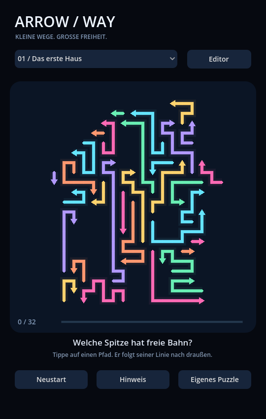
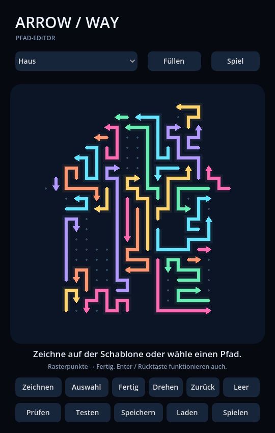

# ArrowWay

Ein spielbarer Godot-Prototyp für farbige Pfeilpfade: freie Pfade entkommen entlang ihrer Linie, blockierte Pfade bleiben liegen. Sechs lösbare Puzzle in Haus-, Weihnachtsbaum- und Herzform sowie ein erster integrierter Editor.



## Start

Godot **4.x Standard** verwenden; geprüft mit **4.7.2**, GDScript und Compatibility-Renderer. `project.godot` importieren und **F5** drücken. Die ausführliche deutsche Anleitung steht in [START.md](START.md).

## Aktueller Stand · 0.2.0

- Sechs Levels mit 25–32 Pfaden und allen vier Pfeilrichtungen.
- Neonlinien, kurze Entkommensanimation, Blockierungsfeedback und Hinweise.
- Levelauswahl, Fortschrittsanzeige und lokal gespeicherte Freischaltungen.
- Editor: Schablone wählen, automatisch füllen, Rasterpfade zeichnen, auswählen, Richtung umkehren, löschen, Lösbarkeit prüfen und direkt spielen.
- Eigene Puzzle als JSON speichern und laden; ein lokaler Speicherplatz.
- Maus- und Touch-Eingabe; Hochformat mit skalierbarer Darstellung.

## Aufbau

- `puzzle.gd`: Formenmasken, reproduzierbarer Generator, geometrische Blockierungsprüfung und Lösungsfolge.
- `main.gd`: Spielzustand, Animation, Benutzeroberfläche, Editor und lokale Speicherung.
- `board.gd`: Darstellung der Pfade innerhalb des Spielfelds.
- `tests/test_runner.gd`: Spiellogik und Editorintegration.

Die Formen bestehen aus Rasterzellen. Der Generator setzt Pfade in umgekehrter Lösungsreihenfolge und füllt anschließend erreichbare Lücken, sofern die Lösung erhalten bleibt. Die Puzzle füllen die Schablone teilweise; einzelne freie Rasterzellen sind möglich. Alle Pfade bestehen aus echten Punktfolgen. Die Blockierungsprüfung berücksichtigt auch parallele Linien, Linienenden und die eigene Pfadgeometrie.

Der Lösbarkeitstest baut einen Abhängigkeitsgraphen und entfernt schrittweise freie Pfade. Er prüft dieselbe Geometrie wie das Spiel. Da entfernte Pfade keine neuen Blockaden erzeugen, genügt diese Reihenfolge zur Prüfung.

## Tests

```powershell
godot --headless --path . --editor --quit
godot --headless --path . --script res://tests/test_runner.gd -- --test
```

Bei einer portablen Installation `godot` durch den vollständigen Pfad zur Godot-Konsole ersetzen. Der erste Befehl importiert ein frisches Checkout und registriert die Scriptklasse.

Geprüft werden vollständige Lösungsfolgen aller sechs Levels, weitere Generator-Seeds, überlappungsfreie Formen, vier Entkommensrichtungen, blockierte Klicks, Hinweise, zyklische Abhängigkeiten, Selbstblockaden, Editorzeichnung und Richtungswechsel, JSON-Rundlauf, Testmodus und Rückkehr sowie ungültige Speicherdateien. Testdateien sind von normalen Spielständen getrennt.

## Nächste Ausbaustufen

Dieser Stand ist ein Desktop-Prototyp. Android-Export, Bedienung auf echten Smartphones und Schwierigkeit müssen noch geprüft werden. Ein eigener Bildimport, Bereichsfüllung, eine Bibliothek mehrerer eigener Levels, Sounds und Veröffentlichung sind noch nicht implementiert.


